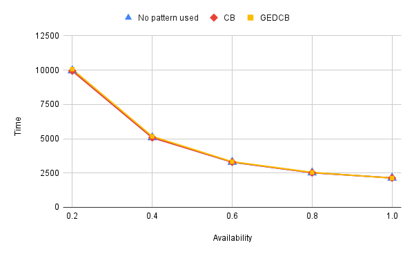
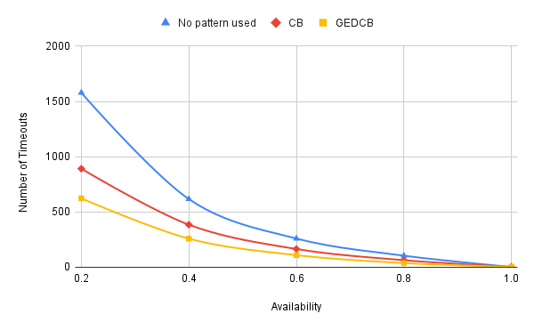
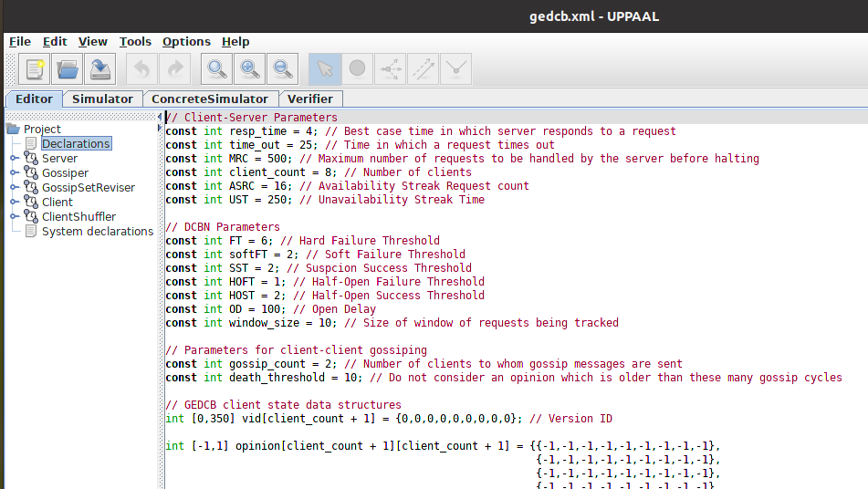
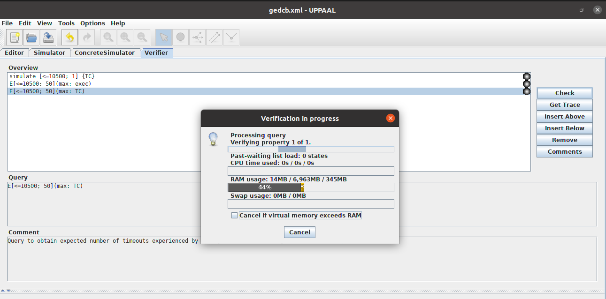
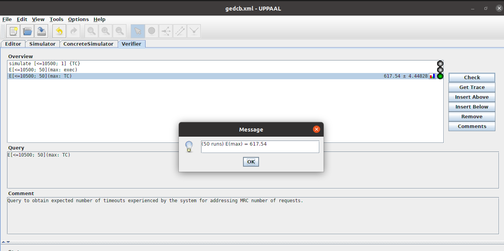

# Reproducing results of the GEDCB paper

## Major Results Obtained
### 1. Execution Time

<br>
The work claims that the proposed resiliency pattern (GEDCB) is as good as the traditionally used circuit breaker pattern (CB) in terms of total execution time. We gathered data points using the UPPAAL models to demonstarte that the total execution time for a client-server system to fulfill <i>MRC</i> number of requests is almost the same for the cases when the system uses GEDCB or CB under various unavailability scenarios.
<br>
<br>

### 2. Number of failures for which resources are allcoated

<br>
The work claims that the proposed resiliency pattern (GEDCB) is better than the traditionally used circuit breaker pattern (CB) in terms of number of failures experienced by the system. We gathered data points using the UPPAAL models to demonstarte that the  number of failures for a client-server system to fulfill <i>MRC</i> number of requests is almost the same for the cases when the system uses GEDCB or CB under various unavailability scenarios.
<br>
<br>

## Setting model parameters
We have three model files corresponding to the three cases - no-resiliency pattern, CB and GEDCB. Following paramters were used to obtain the above results. These parameters appear in the form of variables in the model files and may be assigned different values.

|Parameter|Meaning|Value Used|
|:----------:|--------|:---------:|
| resp_time | Response Time | 4 |
| time_out | Timeout Period | 25 |
| UST | Unavailability Streak Time | 250 |
| window_size | Window Size | 10 |
| softFT | Soft Failure Threshold | 2 |
| (H)FT | (Hard) Failure Threshold | 6 |
| HOFT | Half-Open Failure Threshold | 1 |
| HOST | Half-Open Success Threshold | 2 |
| SST | Suspicion Success Threshold | 2 |
| OD | Open Duration | 100 |
| s_delay | Client Shuffling Period | 500 |
| delay | Client Gossiper Period | 4 |
| revision_time | Gossip Set Revision Period | 40 |
| MRC | Maximum Request Count | 500 |
| gossip_count | Number of clients gossiped to | 2 |
| infection_count | Number of clients receiving set revision message | 2 |

To model availability scenarios, following paramter values were used (reasoning explained in section V-B of the accepted paper).

| Availability | ASRC | USC |
|:------------:|:----:|:---:|
| 1 | 500 | 0 |
| 0.8 | 167 | 2 |
| 0.6 | 84 | 5 |
| 0.4 | 39 | 12 |
| 0.2 | 16 | 32 |

Following image shows few of the variables that act as model parameters as seen in the `gedcb.xml` file launched in UPPAAL GUI. Relevant variables may be assigned different values as per the experimenter's needs.


## Steps to reproduce results
The graphs are plotted using data points (availability_value, execution_time) and (availability_value, failure_count). To collect all data points, SMC queries must be performed on all three models under all five availability scenarios.

## Step 1
Set availability scenario by setting the value of `ASRC` variable as per the above table. Keep other variables (parameters) to their originally assigned values. Save the changes using `ctrl+S`
## Step 2
Switch to the <b>verifier</b> section in the GUI. Click on the query to be executed and hit `Check`. UPPAAL emits the expected value (our data point) as a result of this run.
<br>
Note:
For the failure data point run:
```
E[<= 10500; 500](max : TC)
```
For the execution time data point run:
```
E[<= 10500; 500](max : exec)
```

The queries shown above provide the expected maximum value of the variable `TC` and the clock variable `exec` respectively within the time 10500 units evaluated over 500 simulations (use 50 simulations for a less accurate but faster result).




The above screenshot shows that under the `ASRC` value of 16 for the GEDCB case, 617.54 failures are registered to fulfil <i>MRC</i> (500) requests. Repeat the process for all the three models for all the five availability scenarios and plot the graph using the collected data points for failures as well as the execution time.